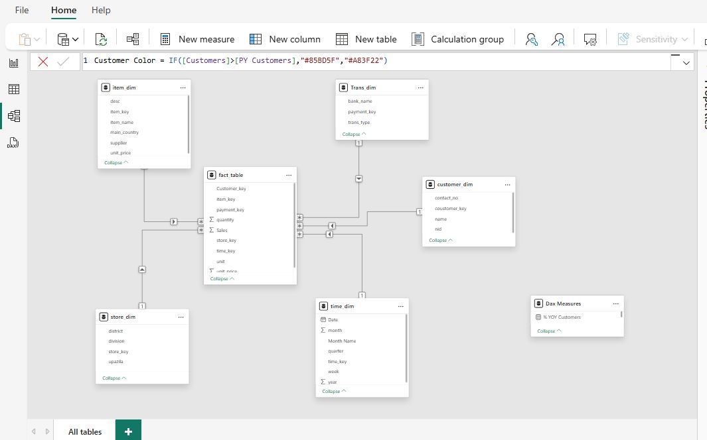
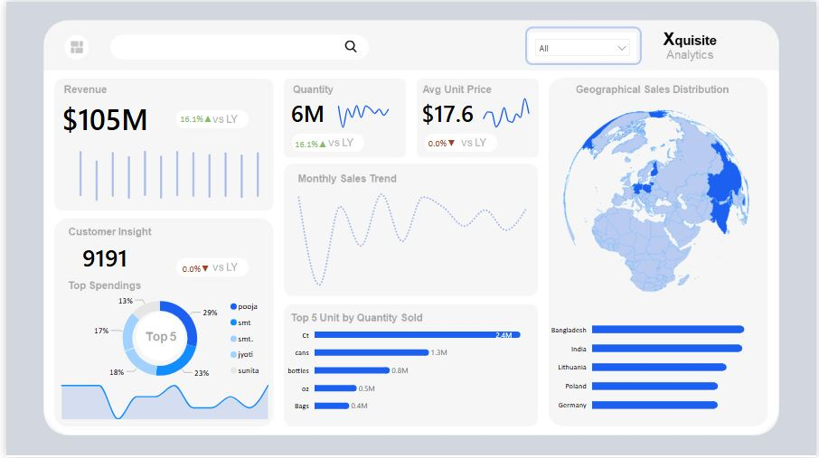

# E-commerce-Sales-Analysis
This is an E-commerce Sales Analysis to uncover key trends shaping Sales Performance using Power bi.

---

## Introduction 

The E-commerce sales analysis is a comprehensive analysis using  dashboard,it provides unified and interactive view of organizational sales performance. By consolidating unstructured raw data into a structured and visual format, the dashboard enables stakeholders to monitor revenue, quantity sold, unit pricing, customer engagement, and geographical distribution.  

---

## Problem Statement 

Organizations often struggle with fragmented sales data spread across multiple sources, making it difficult to answer critical questions such as:  

- **Revenue growth**: Are we improving compared to last year?  
- **Customer insights**: Who are our top contributors, and how concentrated is revenue among them?  
- **Product performance**: Which units drive the most sales volume?  
- **Market expansion**: Which geographies present the best growth opportunities?  
- **Operational efficiency**: How do pricing trends and unit economics affect profitability?  

Without a **centralized data model** and **visual analytics**, decision-making becomes reactive, inconsistent, and less impactful. This project addresses these challenges by consolidating data into a single source of truth and creating an intuitive dashboard that answers these key business questions.

---

## Project Objectives 

The primary objective of this project is to:  

**Evaluate sales performance and growth trends across products, customers, and geographies by comparing current-year results with previous-year benchmarks.**  

Supporting objectives include: 

1. **Enable KPI tracking** for revenue, sales volume, average unit price, and customer base.
  
3. **Identify top-performing products** and optimize product mix.  
4. **Highlight geographical markets** with strong sales contributions and potential for expansion.  
5. **Analyze customer spending concentration**, identifying both top contributors and opportunities for diversification.  
6. **Standardize reporting** with consistent calculations (YoY, growth rates, color indicators).

## Data Transformation and Cleaning   

To prepare the raw data for analysis, the following steps were carried out using Power Query: 

1 **Cleaning:** Standardize text into proper case, Replace uncessary dots after values using find and replace,deleted irrelevant columns not important for further anysis
2. **Fixing Date Column with Locale**

The dataset had inconsistent **date formats** due to regional settings. For example, `03/07/2024` was read as **March 7** (US format) instead of **July 3** (UK format).  

To resolve this in Power Query:  
- The column type was changed **Using Locale**.  
- Selected **Date** as data type.  
- Applied the correct locale (e.g., *English (United Kingdom)*).  
 This is crucial for **time intelligence calculations** like YoY and MoM.
---
## Data Normalization 

To ensure accuracy, efficiency and consistency in reporting, the sales data was normalized before modeling.  

#### First Normal Form (1NF)  
- Ensured atomic values in the fact table (e.g., one row per sales transaction with no repeating groups).  

#### Second Normal Form (2NF)  
- Removed partial dependencies by separating sales facts from descriptive attributes.  
- Example: Product details moved into **item_dim**, customer details into **customer_dim**, and time attributes into **time_dim**.  

#### Third Normal Form (3NF)  
- Eliminated transitive dependencies by ensuring attributes depend only on primary keys.  
- Example: Store region details placed in **store_dim** instead of repeating across transactions.  

This normalization process reduced redundancy, improved query performance, and created a clean **star schema** where the **fact_table** connects seamlessly to multiple dimensions.

---
## Data Modelling   

The data model follows a **Star Schema Design** to optimize reporting and analysis.  

#### Fact Table  
**fact_table**  
- Contains transactional data for sales performance.  
- Key fields:  
  - `Customer_key`  
  - `item_key`  
  - `payment_key`  
  - `store_key`  
  - `time_key`  
  - `quantity`  
  - `Sales`  
  - `unit`  

#### Dimension Tables  
1. **item_dim**  
   - Holds product/item details.  
   - Columns: `item_key`, `item_name`, `desc`, `unit_price`, `supplier`, `main_country`.  

2. **customer_dim**  
   - Stores customer details.  
   - Columns: `customer_key`, `name`, `contact_no`, `nid`.  

3. **store_dim**  
   - Contains store and location information.  
   - Columns: `store_key`, `district`, `division`, `upazila`.  

4. **time_dim**  
   - Provides the time hierarchy for analysis.  
   - Columns: `time_key`, `Date`, `month`, `Month Name`, `quarter`, `week`, `year`.  

5. **trans_dim**  
   - Represents payment/transaction details.  
   - Columns: `payment_key`, `bank_name`, `trans_type`.  

6. **DAX Measures Table**  
   - Logical table holding KPIs and calculations.  
   - Example: `% YOY Customers`.  

#### Relationships 

- The **fact_table** sits at the center and connects to each dimension via foreign keys.  
- Relationships are one-to-many (`1:*`) from each dimension to the fact table.  
- This design ensures efficient slicing of sales data across products, customers, geography, transactions, and time.  

#### Schema Diagram  
The diagram below shows the star schema in Power BI: 

---

## Analysis and Calculations Using DAX

This analysis was done using DAX to quantify the various metrics  grouped into;
- **Base Measure** : Total Sales,Total Quantity etc
- **Previous Year (PY) Measure** :PY Sales,PY Qty etc
-  **Year Over Year (YOY) Measure** &
- **Color Measures which is the conditional colour Indicator**.

### Base Measure

- **Total Sales**

Total Sales = SUM(fact_table[Sales])

- **Total Quantity**

Total Qty = SUM(fact_table[quantity])

- **Average Unit Price**

Avg Unit Price = AVERAGE(fact_table[unit_price])

- **Customers**

Customers = DISTINCTCOUNT(fact_table[Customer_key])

### Previous Year (PY) Measure

- **Previous Year Sales**

PY Sales = 
CALCULATE(
    [Total Sales],
    SAMEPERIODLASTYEAR(time_dim[Date]),
    REMOVEFILTERS()
)

- **Previous Year Quantity**

PY Qty = 
CALCULATE(
    [Total Qty],
    SAMEPERIODLASTYEAR(time_dim[Date]),
    REMOVEFILTERS()
)

- **Previous Year Unit Price**

PY Price = 
CALCULATE(
    [Avg Unit Price],
    SAMEPERIODLASTYEAR(time_dim[Date]),
    REMOVEFILTERS()
)

- **Previous Year Customers**

PY Customers = 
CALCULATE(
    [Customers],
    SAMEPERIODLASTYEAR(time_dim[Date]),
    REMOVEFILTERS()
)

### Year Over Year (YOY) Measures

- **YoY Sales %**

% YOY Sales =

VAR a = DIVIDE([Total Sales],[PY Sales]) - 1
VAR label = FORMAT(a,"#0.0%")
RETURN label & IF(a > 0, "▲","▼")

- **YoY Quantity %**

% YOY Qty =

VAR a = DIVIDE([Total Qty],[PY Qty]) - 1
VAR label = FORMAT(a,"#0.0%")
RETURN label & IF(a > 0, "▲","▼")

- **YoY Price %**

% YOY Price =

VAR a = DIVIDE([Avg Unit Price],[PY Price]) - 1
VAR label = FORMAT(a,"#0.0%")
RETURN label & IF(a > 0, "▲","▼")

- **YoY Customers %**

% YOY Customers =

VAR a = DIVIDE([Customers],[PY Customers]) - 1
VAR label = FORMAT(a,"#0.0%")
RETURN label & IF(a > 0, "▲","▼")

### Color Measures 

- **Sales Color Indicator**

Sales Color = IF([Total Sales] > [PY Sales], "#85BD5F", "#A83F22")

- **Quantity Color Indicator**

Qty Color = IF([Total Qty] > [PY Qty], "#85BD5F", "#A83F22")

- **Price Color Indicator**

Price Color = IF([Avg Unit Price] > [PY Price], "#85BD5F", "#A83F22")

- **Customer Color Indicator**

Customer Color = IF([Customers] > [PY Customers], "#85BD5F", "#A83F22")

---

## Data Visualisation (Dashboard)

---

## Insights 

--- 
## Conclusion 

--- 
## Recommendation 

---
## About me 

- I transform complex data into , actionable insights.
Using analytics, machincleare learning, and visualization, I help you understand trends, improve efficiency, and plan for the future.

Connect with me @https://www.linkedin.com/in/adetokunbo-olasupo-70aa042a1

